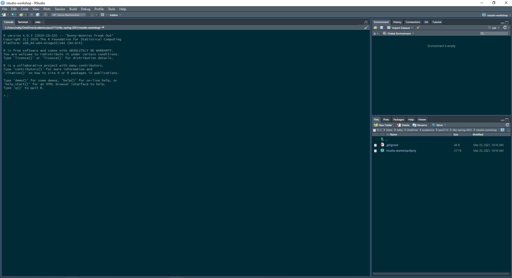

```{r setup, include=FALSE}
knitr::opts_chunk$set(echo = TRUE,
											fig.width = 7, fig.height = 4)
library(tidyverse) #tidyverse
library(kableExtra) # one way to make tables
library(stargazer) # Another way to make tables (can also output esttab to .tex--examples below)
library(ggExtra)
theme_set(theme_minimal())
library(ggridges)
library(gridExtra)
```

# Many `R`oads to Success!

When first learning to code in R students often feel like there is exactly one way to get to a desired result. One way to load data, one way to draw a density plot, one way to run a regression---this is (emphatically) not true! In almost every case, there are multiple perfectly legitimate ways to conduct an analysis and generate the output you seek, which is great news for a new student! When you have a limited knowledge of R, it is easy to think of coding as a collection of very discrete tasks, where you have one set of functions and syntax to make a scatterplot, and a totally different set of functions and syntax to import data or run a regression. In reality, there is much more similarity between these tasks than difference.

Getting better at R comes from letting yourself experiment with your coding strategy, learning where you can apply techniques from other applications. This may seem confusing right now---that's fine! This document is intended to get you up to speed with the basics of R and to illustrate how much freedom you have in conducting analyses with RStudio.

## Packages

One of the reasons RStudio has so many different overlapping approaches to problems is because of **packages**. A package is a library of functions that you **install** and **load** to extend RStudio's functionality. A function which is not part of an external package is said to be part of base-R, that is that it comes built in to R by default. Without a doubt, the most important package is `tidyverse`, a collection of smaller packages that improve on every aspect of base-R, from loading data, cleaning data, visualizing data, etc. `tidyverse` was first published in 2013, so older RScripts are likely not to make use of the package---which is evidenced by the complexity (and length) of their code.

# Writing a script

## Project Directory

Before you start coding, you need to create a new project directory. A `.proj` file simply tells RStudio to start looking for files from whichever directory your `.proj` file is in&mdash;it's the equivalent of using the `setwd(...)` function at the top of a script, but you only have to do it one time, even if you have multiple scripts that you're working in. The other benefit, is that you can share the project directory with an instructor or colleague and your code will function perfectly. If you set a working directory, the person to whom you share a script will have to manually set their own working directory, which can be frustrating, inefficient, and error-prone. It's a good habit to **always** work in a project environment.

See the screenshots below to set up your project.


Congratulations! You now have a new project open, but you need to make a new script so you can actually write some code! Click the new script button in the upper left, then save the script (ctrl-s on Windows or cmd-s on a Mac), givign it a descriptive name. Your script is in the upper-left quadrant of your RStudio window and it is where you will write the bulk (if not all) of your code. If you want code to be saved you **must** write it in your script, not the console or terminal window below.



## Download your data.

For this project, download the file `states.dta` from the "datasets" folder on the course canvas. Save it to the project directory you created above (or drag and drop it from your downloads folder).

## Load packages

Now that we have a script, we can load our packages, this is done with the `library()` function. Here we are loading `tidyverse` and `haven`. `haven` is a small package that lets us read Stata datasets (`.dta`). If you don't have these installed you can do so by installing them through the "Packages" tab in the bottom right of the screen (as in the screenshots below) or by typing `install.packages(c("tidyverse", "haven"))` in the **console**. You only need to install packages once; but you need to **load** them every time you start RStudio.

```{R}

#Loading packages
library(tidyverse) #We will load tidyverse in every single R script we write. It is invaluable
library(haven) #Haven contains the read_dta() function; this allows us to read Stata (.dta) files
library(ggeffects) #ggeffects contains useful functions for calculating and plotting predicted values
```
You might get a warning that one or more of your packages was built under a different version of R. This is probably not an issue and you shouldn't worry about it!


## Load your data

To load data in R, it needs to be in a **dataframe**&mdash;an **object** made up of columns (variables) and rows (observations). We do this by using a function to **read** the dataset from your computer and the `<-` operator to put the data into the dataframe:
```{R}
states_df <- read_dta("states.dta") #You can say this as "states_df gets states.dta. i

	glimpse(states_df) #take a quick peek at your data, make sure it looks how you expect
```
Above, we used the function `read_dta()` from the `haven` package, because our dataset is a `.dta` file. If we had a `.csv` or `.rds` file, we would use the functions `read_csv()` or `read_rds()` from `tidyverse.

You can name your dataframe anything (besides `TRUE` and `FALSE`), but try to make it descriptive to you. Since our dataset is called `states.dta`, I called the dataframe `states_df` because it is short and descriptive.

## Start visualizing your data

### Density plots

Let's make a few density plots of the variable `womleg_2011`, the proportion of women in the state legislature in the year 2011.
```{R}
#Here is how you can make a density plot in base-R. I do not recommend this approach, but it is worthwhile learning it to build your understanding or R.
#In your work, you are quite likely to come across older Rscripts which use these functions, and you should know how to read those.
plot(density(states_df$womleg_2011))

#qplot is a function in the ggplot package that functions similarly to plot() in base-R
#qplot picks the appropriate plot style automatically based on the number and type of variables that you input.
#qplot is handy when you want to get a quick peek at the data, but you're better off using ggplot() if you want to generate a publication quality visual.
qplot(states_df$womleg_2011)

# Here is a density plot of womleg_2011 in ggplot() this probably looks familiar to you from last semester
ggplot(data = states_df, aes(x = womleg_2011)) +
	geom_density()
```

As you can see, these three approaches (`plot()`, `qplot()`, and `ggplot()`) look quite different, but they all generate plots which look about the same. `ggplot()` is the approach I recommend for almost every application. It's very easy to extend, customize, and label your plot in ways that are difficult with `plot()`, or `qplot()`. 

Now let's try making a scatterplot with `ggplot()`. Here we're using variables for percent of the legislature who are women and the percentage of unionized workers in the laborforce.

### Scatterplot
```{R}
ggplot(data = states_df, aes(x = union10, y = womleg_2011)) +
	geom_point() +#the geom_point() argument tells ggplot to make a scatterplot with these data
	labs(x = "Percent Workers Unionized (2010)", #adding some nice labels
			 y = "Percent of Legislature Women (2011)",
			 title = "Unionization and Women's Representation")
```
### Regression

Taking those same variables, let's run a bivariate regression analysis. A linear regression is done with the function `lm()`. The first argument in `lm()` is the regression formula. Write your **dependent** (outcome) variable on the left hand side and our **independent** variable on the right hand side. In place of `=`, we have to use the `~` in the formula (since `=` already means something to R).

```{R}

bv_model <- lm(womleg_2011 ~ union10, data = states_df) #running the regression and putting it in an object
summary(bv_model)
```

`summary(bv_model)` returns lots of useful information about our regression. We see the estimate of the coefficient (the **slope** of our line). In this case, our coefficient estimate tells us that a one unit increase in union membership is associated with a `.4227` unit increase in women's descriptive representation. We also see the p-value, which tells us the probability of observing a relationship as (or more) extreme than this one by chance. In other words, if the **null hypothesis** is true, we would expect to find an association as strong or stronger than .4227 about $.8\%$ of the time. This is a **statistically significant** result.

```{R}

#running some predictions. Predicting the percent of women in the legislature at min/max valu
predict(bv_model, data.frame(union10 = min(states_df$union10))) #min() and max() are functions that return the min/max of a variable
predict(bv_model, data.frame(union10 = max(states_df$union10)))

#lets plot this line in our ggplot()

#create a dataframe containing all values of the regression line
bv_predict <- ggemmeans(bv_model, terms = "union10")  #Here you use quotation marks around the column. This is an exception to the rule---i'm not sure why!
glimpse(bv_predict)
```

`glimpse()`ing `bv_predict`, we see several columns. `x` is simply all the x values at which we have observations and `predicted` is the **estimated y value of the regression line**. `std.error` is the standard error of the estimate. `conf.low` and `conf.high` are the upper and lower confidence intervals. We'll cover `group` a bit later.

Now, we can add this prediction to our `ggplot()`, by adding our predicted dataframe to `geom_line()`! In `ggplot()`, you can call more than one dataframe by adding the `data = ...` and `aes()` arguments to your `geom_*`. You don't need to do this too often, but is helpful in this case. If you don't call `data =` or `aes()` in your geometry, the `geom_*()` argument will simply use whatever data and aesthetics you called initially.

To add your regression line to the scatterplot, you can copy-and-paste your scatterplot code from above and add `geom_line(data = bv_predict, aes(x = x, y  = predicted))`, like so. Remember to add a `+` to each function except for the last. 

```{R}

ggplot(data = states_df, aes(x = union10, y = womleg_2011)) +
	geom_point() +#the geom_point() argument tells ggplot to make a scatterplot with these data
	geom_line(data = bv_predict, aes(x = x, y  = predicted)) +
	labs(x = "Percent Workers Unionized (2010)", #adding some nice labels
			 y = "Percent of Legislature Women (2011)",
			 title = "Unionization and Women's Representation")

```

Now let's do the same thing with a multivariate model. We've added a control variable `cook_index`, which shows states' partisanship&mdash;low values indicate a state is more Republican, high values more Democratic. Using the function `ggemmeans()` we can estimate the "effect" of union membership on women's representation at different levels of partisanship. This lets us show the predicted "effect" of `x` on `y` at diffent levels of our control variable.

```{R}
mv_model <- lm(womleg_2011 ~ union10 + cook_index, data = states_df) #run the regression just as before, adding cook_index to your formula
summary(mv_model)

mv_predict <- ggemmeans(mv_model, terms = c("union10", "cook_index")) #since we have two terms we have to wrap them in the c() function. We are giving `ggemmeans()` a list, not a single value
	glimpse(mv_predict)
```
Notice when we `glimpse(mv_predict)` we get three different values in `group`. These are different **terciles** of `cook_index`, and are calculated automatically by `ggemmeans`. We can make use of these in our `ggplot()`, by mapping the color aesthetic to `group`.

```{R}

ggplot(data = states_df, aes(x = union10, y = womleg_2011)) +
	geom_point() +#the geom_point() argument tells ggplot to make a scatterplot with these data
	geom_line(data = mv_predict, aes(x = x, y = predicted, color = group)) +
	labs(x = "Percent Workers Unionized (2010)", #adding some nice labels
			 y = "Percent of Legislature Women (2011)",
			 color = "Cook Index", #titling our legend
			 title = "Unionization and Women's Representation")


```

Now, instead of one estimate, we have three&mdash;one for each tercile of our partisan cook index control variable. When we control for partisanship, the apparent positive relationship between union membership and women's representation disappears.

